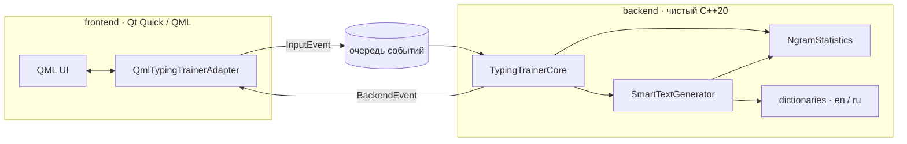

# Typing Trainer

> Десктопный тренажёр слепой печати, который находит ваши слабые сочетания клавиш
> и собирает упражнения именно под них.

[](https://en.cppreference.com/)
[-41cd52.svg)](https://www.qt.io/)
[](https://cmake.org/)
[](#сборка-из-исходников)
[](LICENSE)

<!-- TODO(release): добавить сюда скриншот или GIF тренировки -->

---

## Что это

Большинство тренажёров гоняют всех по одному и тому же тексту. Этот — наоборот:
он измеряет время и ошибки по каждой **n-грамме** (1–3 символа), вычисляет, какие
сочетания даются вам тяжелее всего, и составляет из реальных слов текст, насыщенный
именно ими. Статистика копится между запусками — чем дольше пользуетесь, тем точнее
подбор.

Два режима тренировки:

| Режим | Описание |
|-------|----------|
| **Smart** | Текст генерируется из частотного словаря под ваши проблемные n-граммы. |
| **Свободный** | Тренировка на собственном тексте. |

---

## Возможности

- 🎯 **Адаптивные упражнения** — текст подстраивается под персональные слабые n-граммы.
- 🌍 **Два языка** — русский и английский словари, выбор прямо в сессии.
- ⚙️ **Гибкая настройка сессии** — язык, размер блока, «сложность» (доля
  слов-наполнителей), регистронезависимость.
- ⏯️ **Пауза и возобновление** без потери прогресса и метрик.
- 📊 **Метрики в реальном времени** с подсветкой ошибок и текущей позиции.
- 💾 **Локальное хранение** статистики в JSON — без серверов и аккаунтов.
- ⚡ **Неблокирующий UI** — вычисления вынесены в фоновый поток, интерфейс не подвисает.

---

## Метрики

| Метрика | Что показывает |
|---------|----------------|
| **WPM** | Слов в минуту. |
| **CPM** | Знаков в минуту. |
| **Точность** | Доля верных нажатий, %. |
| **Consistency** | Ритмичность темпа — насколько ровные интервалы между нажатиями, % (а не только скорость). |

---

## Архитектура

Проект разделён на два слоя, общающихся через единственный контракт
[`src/contracts.hpp`](src/contracts.hpp): фронтенд не знает о внутренностях ядра, ядро не
знает о Qt.



- **`backend/`** — чистый C++20 без Qt. `TypingTrainerCore` (машина состояний сессии и
  метрики), `NgramStatistics` (статистика n-грамм, веса, JSON-персистентность),
  `SmartTextGenerator` (генерация текста), `dictionaries` (словари en/ru).
- **`frontend/`** — Qt Quick/QML. `QmlTypingTrainerAdapter` мостит QML и ядро.

Обмен асинхронный: UI кладёт `InputEvent` в потокобезопасную очередь, фоновый
`std::jthread` обрабатывает их и возвращает `BackendEvent` — полный снимок `SessionState`
или лёгкую дельту `StateUpdate`. UI никогда не блокируется на вычислениях.

**Алгоритм Smart-режима.** Каждое нажатие учитывается во всех n-граммах, оканчивающихся на
текущем символе (накапливаются flight-time, попытки, ошибки; контекст строится по эталонному
тексту, поэтому опечатки его не загрязняют). Вес проблемности грамма:

$$W = T_{avg} + \lambda \cdot \text{error rate}$$

Генератор берёт худшие граммы и собирает блок из словарных слов с этими граммами, разбавляя
обычными словами в заданной пропорции (`filler_ratio`).

---

## Структура проекта

```text
Typing_Trainer/
├── src/
│   ├── main.cpp                     # точка входа, регистрация QML-типа
│   ├── contracts.hpp                # единственный контракт между слоями
│   ├── concurrent_queue.hpp         # потокобезопасная очередь событий
│   ├── backend/                     # ядро на чистом C++20 (без Qt)
│   │   ├── typing_trainer_core.*    # машина состояний сессии и метрики
│   │   ├── ngram_statistics.*       # статистика n-грамм, веса, JSON
│   │   ├── smart_text_generator.*   # генерация текста под слабые граммы
│   │   └── dictionaries.*           # встроенные словари en/ru
│   └── frontend/                    # Qt Quick / QML
│       ├── typing_trainer_adapter.* # мост QML ↔ ядро
│       ├── main.qml, Theme.qml
│       └── elements/                # переиспользуемые QML-компоненты
├── CMakeLists.txt
├── CMakePresets.json                # пресеты сборки (vcpkg-debug / vcpkg-release)
└── build-*.ps1                      # вспомогательные скрипты сборки (Windows)
```

---

## Установка

Готовые сборки публикуются во вкладке
[**Releases**](https://github.com/TihonSotnikov/Blind_Typing_Trainer/releases) — скачайте
архив под свою ОС и запустите. Чтобы собрать из исходников, см. раздел ниже.

---

## Сборка из исходников

**Требования:** C++20 (GCC 11+, Clang 13+, MSVC 19.30+), CMake 3.21+, Qt 6
(`Core Qml Quick Widgets QuickControls2 QuickEffects`), [nlohmann/json](https://github.com/nlohmann/json).
Пресеты сборки — в [`CMakePresets.json`](CMakePresets.json).

### Windows (vcpkg)

Зависимости ставятся через [vcpkg](https://github.com/microsoft/vcpkg); переменная
окружения `VCPKG_ROOT` должна указывать на каталог vcpkg.

```powershell
# Установить зависимости (может занять продолжительное время):
vcpkg install qtbase:x64-windows qtdeclarative:x64-windows nlohmann-json:x64-windows

# Собрать и установить в ./dist (или просто запустите build-release.ps1):
cmake --preset vcpkg-release
cmake --build --preset release
cmake --install build/vcpkg-release --prefix "$pwd/dist"
```

### Linux

```sh
sudo apt install build-essential cmake qt6-base-dev qt6-declarative-dev nlohmann-json3-dev \
  qml6-module-qtquick qml6-module-qtquick-controls qml6-module-qtquick-layouts
cmake -S . -B build -DCMAKE_BUILD_TYPE=Release
cmake --build build
./build/TypingTrainer
```

---

## Статус и планы

Текущая версия — рабочий MVP (Smart- и свободный режимы, метрики, персистентность).
В планах:

- [ ] Экран статистики: история результатов и самые проблемные n-граммы.
- [ ] Расширение словарей и новые языки.
- [ ] Автотесты ядра и CI.

---

## Команда

| Слой | Разработчик | Зона ответственности |
|------|-------------|----------------------|
| **Backend** | Тихон Сотников | Ядро сессии, машина состояний, метрики, алгоритм n-грамм, Smart-генератор, JSON-персистентность, потоковая модель. |
| **Frontend** | Андрей Червов | UI на Qt Quick/QML, адаптер `QObject`, обработка ввода, отрисовка текста и курсора, темы, метрики. |

Граница между зонами — контракт [`src/contracts.hpp`](src/contracts.hpp); изменения
согласуются только через него.

---

## Лицензия

Проект распространяется под лицензией MIT — см. [LICENSE](LICENSE).
